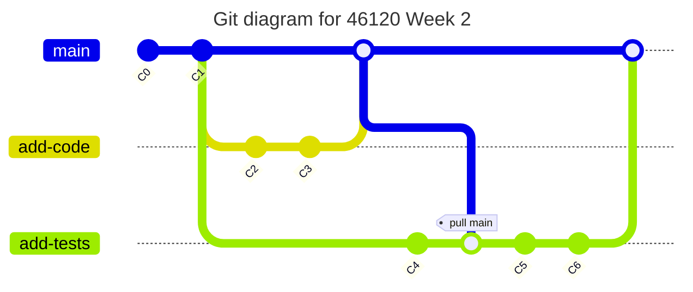
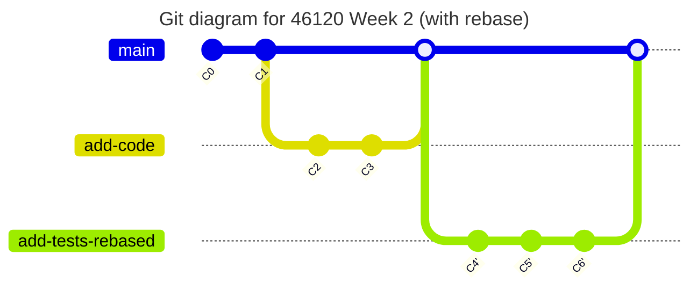

# PiWE Week 2: Functions and Tests

Slides: here in this subfolder.

## Overall objectives

1. Rearrange code in `preclass_assignment/` and write tests that correctly test the functions there.  
1. Draw black-box diagrams of functions.  
1. Complete tutorials on scientific Python packages as preparation for next
week.

## Functions & tests

Functions are a way to bundle code that is meant to be executed multiple
times but with different values. A test is a kind of function that uses an
assert statement to check whether the behaviour of a part of code matches
what is expected.

## Homework due next week

These instructions guide you through a simple git workflow, which is visualized below.
If you want to try a git flow that is better but a little more complex, see [Better git flow](#extra-credit-better-git-flow).
(See also [Notes on "Extra Credit"](#notes-on-extra-credit).)

### Notes on "Extra credit"

Homework in this class will often have sections marked as "Extra credit".
This content has no impact on your grade. It is for you if you have
extra bandwidth and want a deeper or more advanced understanding
of topics. You are welcome to complete, or not complete, parts marked
"extra credit" at your leisure.

### PART 1: As a team, in class

1. Team meeting. Have someone take notes during the meeting and summarize your ultimate agreements in a file called `Collaboration.md` in your P0 team repo.  
    * Who will author/review which feature branches?  
    * How are you collaborating during development, if at all? E.g., pair programming?  
    * How will you review the PRs? E.g., will you meet as a team to review PRs, or...?  
    * What is the internal deadlines for accomplishing which tasks?  
    * What will you do if a team member does not meet their deadline?  
    * How are you communicating?  
    * Note-taker pushes `Collaboration.md`, and other members pull.  
1. Create your two feature branches off main: `add-code` and `add-tests`.  
    * OR see [Better git flow](#extra-credit-better-git-flow) if you want to try something different.  
1. In `main`, run the Week 2 tests, which should FAIL at this point:  
    * Open an Anaconda Prompt.  
    * Change directory to your local copy of your team's repo.  
    * Run pytest on the week2 test: `pytest test_week2.py`.  
    * There should be some white and red text and notes about failures.  
1. Extra credit:   
    * Read the output text from pytest. What error(s) are causing
      the tests to fail? (Do NOT try to fix the error yet! Just try
      to diagnose.)

### PART 2: Individually and/or with your team

The two feature branches should be worked on in parallel.
However, you cannot merge Part B until Part A has been merged into `main` and then pulled into `add-tests`.
Work on Part 3 if you are waiting for a teammate to finish Part A.

Distribute tasks in this part per your in-class discussion (Part 1).

#### A: Make/review/merge a feature branch/PR with restructured code & diagrams

1. Checkout into feature branch `add-code`.  
1. Restructure the code in `preclass_assignment` in your team's repo such that:  
    * There are ONLY two files in the folder: `functions.py` and `main.py`.
      If you prefer `main.py` to be a Jupyter notebook, that's fine.
    * The ONLY code in `functions.py` is the [five functions](https://python-at-risoe.pages.windenergy.dtu.dk/codecamp/preparation.html#Required-exercises)
      that you made for the pre-class assignment.  
    * The code in `main.py` should import/demonstrate/execute the functions, similar to
      what is seen on [the description page](https://python-at-risoe.pages.windenergy.dtu.dk/codecamp/preparation.html#Required-exercises).
      NO functions are defined in `main.py`.
1. Run `main.py` and make sure it properly imports and executes the
   functions.  
1. In VS Code, install the [Draw.io Integration](https://marketplace.visualstudio.com/items?itemName=hediet.vscode-drawio)
   extension by Henning Dieterichs.  
1. In your team repo, create a file called `FunctionDiagram.drawio`:  
    * Open the file in VS Code. You should have a nice view of an
      empty drawing canvas.  
    * Create black-box diagrams of the five functions in `functions.py`.
      Remember to include types of inputs and outputs!
    * Note that if a function does not explicitly return an output, then
      the return value is `None`. 
1. Push your branch and open a PR.  
1. A teammate reviews and merges your PR as agreed in your team.  

#### B: Make/review/merge a feature branch/PR with tests

You can begin work on the tests immediately, but you won't be able to complete this feature branch until Part A is merged into `main` and you pull from `main` to `add-tests`.
Work on Part 3 if you are waiting for a teammate to finish Part 2A.

*NB: To avoid future merge conflicts in this branch, be VERY careful not to add/commit any files in `preclass_assignment/` while you develop your tests!
Pull from main as soon as the PR in Part 2A is accepted.*

 ##### Write first test

1. Checkout into feature branch `add-tests`.  
1. Open `test_week2.py` in VS Code.  
1. Read through the functions and docstrings (triple-quote text below
   the function definition).  
    * How many functions are there? What is each function's purpose?
1. Read through the `test_square_list()` function. Do you understand
   how it works?  
1. Write the test for `test_fibonacci_stop()`:  
    * Use a similar function structure to `test_square_list()`.  
    * Use the same input and expected output as the values in
      [the description page](https://python-at-risoe.pages.windenergy.dtu.dk/codecamp/preparation.html#4.-While-loops).  
    * Update the assert statement, again using `test_square_list()`
      as inspiration.  
1. If Part 2A has been merged into `main`, pull updates from `main` into your branch:    
    * `git checkout add-tests`  
    * `git pull origin main`  
        * If git refuses the pull, saying that local changes may be overwritten, then either `add`/`commit` (if the changes are worth adding to history) or `stash` (if you just want to hide them temporarily).
    * NB: If you committed any changes to `preclass_assignment/`, a merge conflict will arise here.  
    * If you stashed earlier, bring your changes back with `git stash apply`. If any merge conflicts arise, resolve them before proceeding.    
    * If you were able to pull from main, run `pytest` again. Take time and read
      the output from pytest carefully. How many tests are passing now?
      Which ones are still failing?  
1. If Part 2A has NOT yet been merged into `main`, proceed with writing the other tests as best you can. Pull from `main` using above instructions when Part 2A has been merged.  

##### Write other tests

1. Write the test for `test_clean_pitch()`:  
    * Use `test_fibonacci_stop()` and `test_square_list()` as
      inspiration, though make changes as needed.  
1. If Part 2A is merged to `main` and pulled to your branch, re-run `pytest` and
   examine the test output. Are your test functions passing?  
1. Write the test in `test_goldilocks()` for one value:  
    * Choose a single test input and expected print from 
      [the description page](https://python-at-risoe.pages.windenergy.dtu.dk/codecamp/preparation.html#2.-If/else-statements).
    * Use the code in `test_greet()` as an example, and update
      `test_goldilocks()` so it tests the `goldilocks()`
      function for your test input.  
    * NOTES:  
        - Because `greet()` and `goldilocks()` do not return a string but rather
          print text to screen, the test function needs to be set up differently
          than what we saw in the other tests.
          Specifically, we need to use a special `pytest` functionality that captures
          and saves text that would normally be printed to screen. We then assert
          that the "standard output" of what we captured (i.e., `captured.out`),
          is equal to our expected text. Tricky, eh?  
        - `test_greet()` is not perfect! We should have defined an
          `exp_print` variable in `# given` for the expected print output,
          `Hello, world!\n`. Oops!  
1. If Part 2A is merged to `main` and pulled to your branch, re-run `pytest` and
   examine the test output. Are your test functions passing?  
1. Extra credit: update `test_goldilocks()` to check the other test cases. See
   details [Extra credit: test goldilocks](#extra-credit-test-goldilocks-with-parametrization).  
1. If all your test functions are passing, open a PR.  
1. A teammate reviews and merges your PR as agreed in your team.  

### PART 3: Individually

1. In the [PiWE GitHub repo](https://github.com/DTUWindEducation/46120-PiWE),
   there is a subfolder called `tutorials_scientific_python`.  
1. Go through:  
    * (If you need instructions on Jupyter notebooks) `1-introduction_to_jupyter_notebooks.ipynb`  
    * `2a-tutorial_numpy_array_basics.ipynb`  
    * `3a-tutorial_matplotlib_basics.ipynb`
1. Highly recommended if you have time:  
    * `2b-exercise_numpy.ipynb`  
    * `3b-exercise_matplotlib.ipynb`  
1. Once you have finished these tutorials, you're done for this week!  

## Extra credit: better git flow

The git workflow we use above is not ideal.
If you want to learn to use git more cleverly, try using rebase (instead of pull).
For even more of a challenge, and for getting practice with resolving merge commits in a low-stakes situation, use a better feature-branch structure.

### With rebasing

The simple workflow above pulls from `main` into `add-tests`, which is not ideal for branches with large number of commits (see [here](https://gwilym.dev/2021/03/git-rebase-like-a-pro/#1-my-pr-has-a-merge-conflict)).
It's  better to use what is called "rebasing", where git attempts to rewrite your branch's history such that the changes you made are added instead to new commits from the other branch.

With rebasing, your final git history will look like this:

To try rebasing, look through this excellent article and follow the instructions: [Git rebase like a pro](https://gwilym.dev/2021/03/git-rebase-like-a-pro/).
Once you have successfully rebased, push your branch with its rewritten history:  
`git push --force-with-lease`

*NB: Normally GitHub would reject a push if the history has changed.
The `--force-with-lease` option tells GitHub to accept the new history, but the push will fail if the branch has new commits from someone else.*

### Better feature branches

In the simple workflow described above, the person(s) developing the tests must wait for the person writing the code.
This is not good: then the person writing the test is not the person who wrote the function, plus there is a bottleneck in development. Not agile!

It would be better if the different feature branches were split by function(s).
E.g., branch `add-fxns-1-2-3`, would include the (1) restructured code, (2) black-box diagrams, and (3) tests for functions 1, 2 and 3.
Then branch `add-fxns-4-5` would include the same for functions 4 and 5.
The downside, of course, is that this flow will likely result in more merge conflicts, because all the feature branches are touching the same files.

If you want to try developing this way, go for it!
You can also throw rebasing into this flow.

## Extra credit: test goldilocks with parametrization

Update `test_goldilocks()` to test all edge cases shown in
[the description page](https://python-at-risoe.pages.windenergy.dtu.dk/codecamp/preparation.html#2.-If/else-statements).
You could do this in a few different ways:  
 * (Not great) Copy/pasting the function contents and updating the input/expected
   output accordingly. Gets the job done, but messy code.  
 * (Okay) Implementing a for loop in your test function. Ask a TA/instructor if you
   need help iterating over two lists at once, or google the `zip()` function.  
 * (Most elegant) Read up on and implement a [pytest parametrization](https://docs.pytest.org/en/stable/how-to/parametrize.html).  

## Videos, tutorials, and other resources

* [Tutorial on assert statements](https://www.w3schools.com/python/ref_keyword_assert.asp)  
* [Introduction to Python functions, including return values and keyword arguments](https://openstax.org/books/introduction-python-programming/pages/6-introduction)  
* [Short overview on Given, When, Then and connection to other testing concepts](https://martinfowler.com/bliki/GivenWhenThen.html)  
* [A gentle introduction to testing with pytest](https://bas.codes/posts/python-pytest-introduction)  

